# ADS-508
This repo is adapted from the official [Data Science on AWS repo](https://github.com/data-science-on-aws/data-science-on-aws) and adjusted to reflect the capabilities of AWS Learner Labs.
[](https://www.amazon.com/Data-Science-AWS-End-End/dp/1492079391/)


# Important! :warning::warning::warning:
❗ When asked to login to a Canvas account, you will need to create a new account. This is the AWS Canvas account, and will not be the same as your USD Canvas account.

- In AWS Learner Labs once you reach $50 all of your code will be automatically destroyed. In addition, AWS Learner Labs has occasional issues where your environment is not accessible.
- **Be sure that you are ALWAYS storing your code in GitHub. You will not be given extra time to complete an assignment due to your Learner Lab deleting your code.**
- In order to make it easy to complete labs and work on your project, it is highly reccomended that you follow the below process, and at the step where you will create a JupyterLab Space, create two (one for a `lab` one for a `project`. Be sure you are saving your work from the `project` JupyterLab Space to your own GitHub repository.


# Setup Instructions
[](https://youtu.be/_pmREK1teJQ)


## 1. Login to AWS Learner Labs


Be sure to read the [AWS Academy Learner Lab Student Guide.pdf](https://github.com/MADS508/labs/files/12005191/AWS.Academy.Learner.Lab.Student.Guide.pdf)


## 2. Launch the AWS Lab
Within the Learner Lab Setup Guide follow the steps in the [Using Your Learner Lab](https://ole.sandiego.edu/bbcswebdav/pid-2625324-dt-content-rid-35250884_1/xid-35250884_1) section.

1. From the Dashboard select your course. Then click `modules`
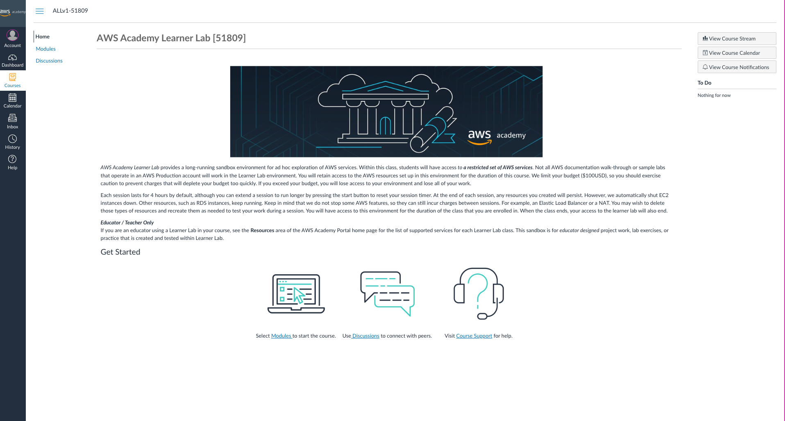

2. Click `Launch AWS Academy Learner Lab`
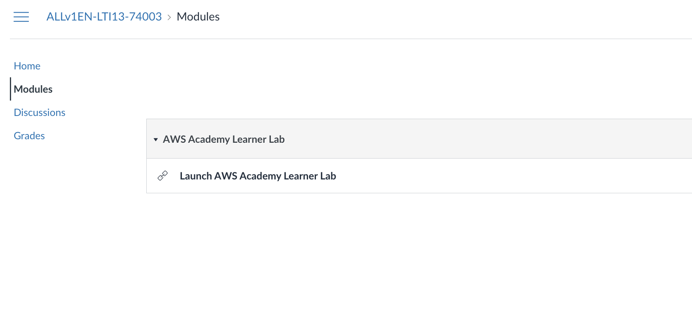

3. In the top right click `Start Lab` This will take 2-3 minutes. Be sure to monitor your budget, once you reach $100 all of your code will be automatically destroyed. **Be sure that you are ALWAYS storing your code in GitHub. You will not be given extra time to complete an assignment due to your Learner Lab deleting your code.**
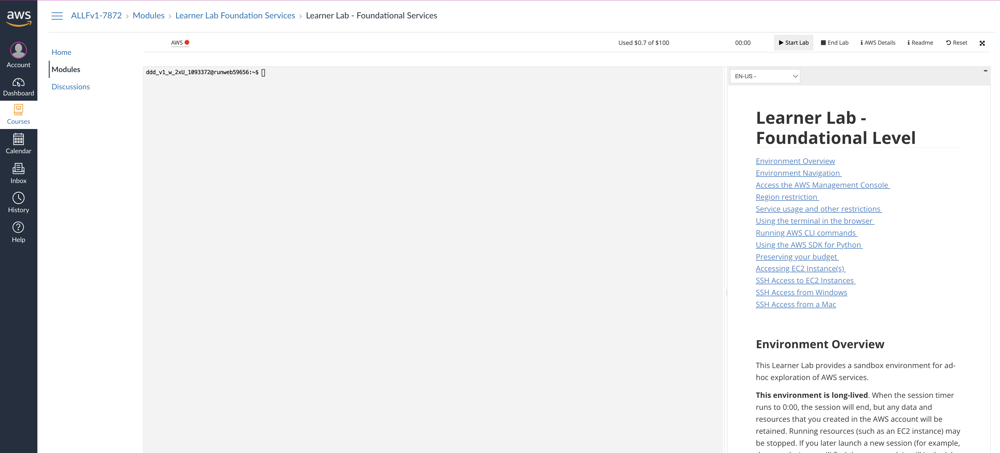

4. Once the lab has loaded you will see a green dot to the right of the AWS status, click it to open the AWS console.


## 3. Launch Amazon SageMaker AI

In the AWS Console search bar, type `SageMaker` and select `Amazon SageMaker AI` to open the service console.

Search for and select `SageMaker`
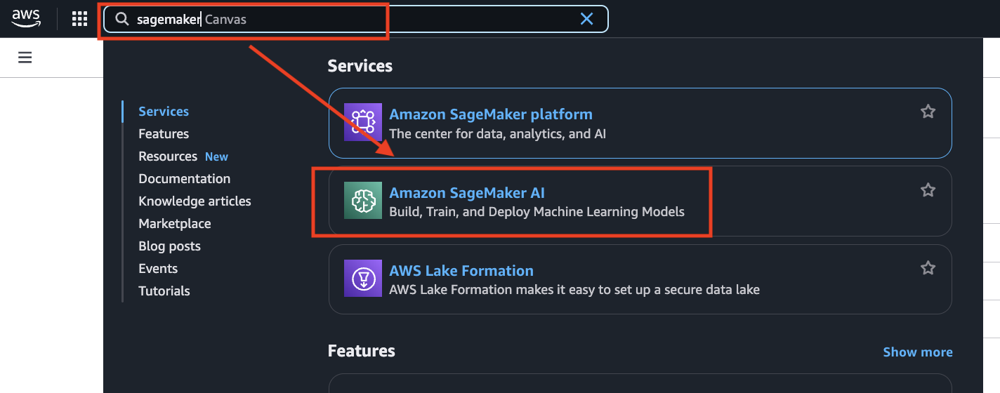

Select `Studio` and then click the button `Set up for organization`
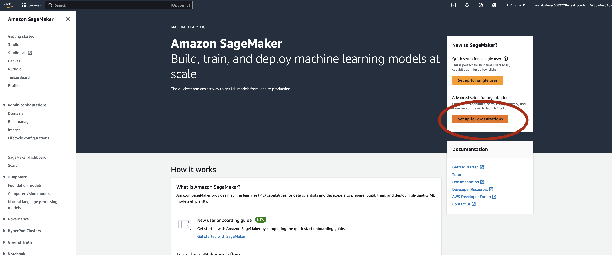

Select the `Set up for organizations` option.
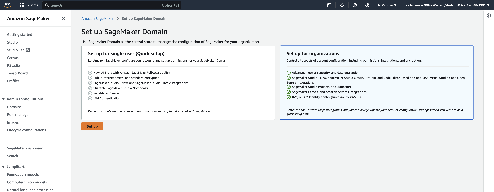

- For the domain name enter `lab`
- For How do you want to access studio, choose Login through IAM
- Leave Who will use Sagemaker blank
- Choose Next.
- If there is a red warning banner that complains about `There is an issue when requesting the service quota. Please try again.`, Ignore it it will not impact your Lab.
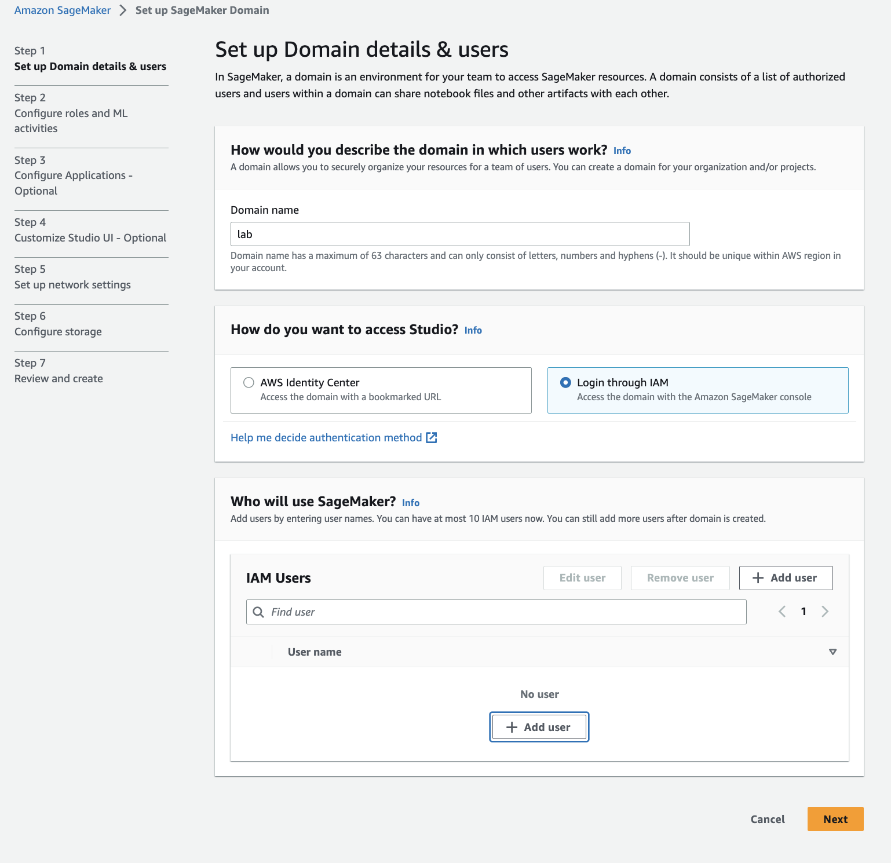

For Configure roles and ML activities
- Select `Use an existing role`
- Be sure LabRole is selected
- Choose Next.
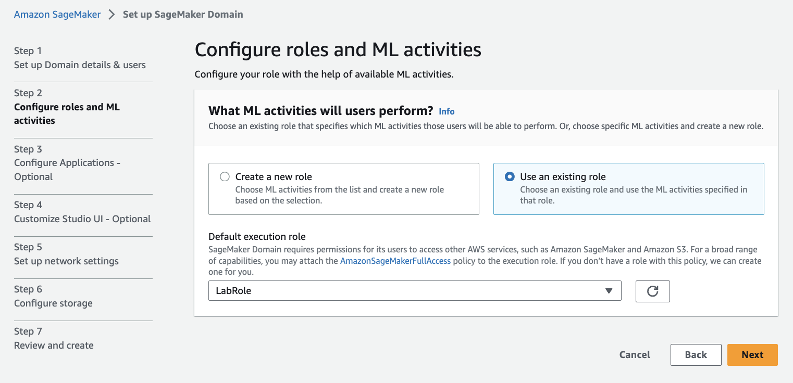

Under `SageMaker Studio` select `SageMaker Studio New`. Under `JupyterLab`, turn on `Enable idle shutdown`.


Expand the Canvas section and disable Amazon Q and disable both MLOps settings and disable `Enable local file upload`


Under `Canvas Ready-to-use models configuration` select `Use an existing execution role`
- Find your AWS ID by clicking on your username in the top right of the screen.
- 
- Replace `834486164294` from `arn:aws:iam::834486164294:role/LabRole` with your account ID (removing the `-`s)


For the `Customize Studio UI` step, leave the defaults and click Next.

For Network, choose public internet access.  Select the existing VPC and all subnets, select the security group named `default`, then choose Next. 
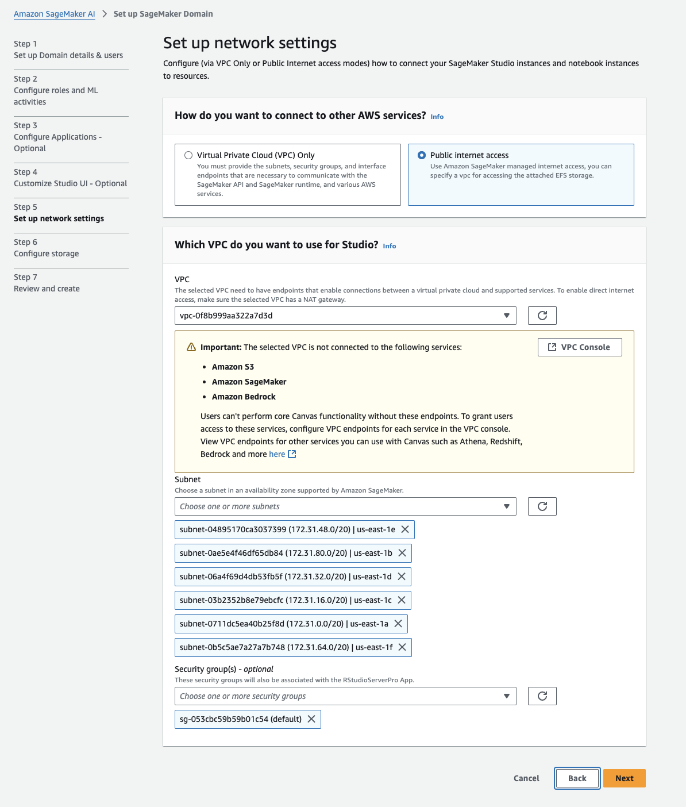

On the Storage screen, leave the settings as is and click next.
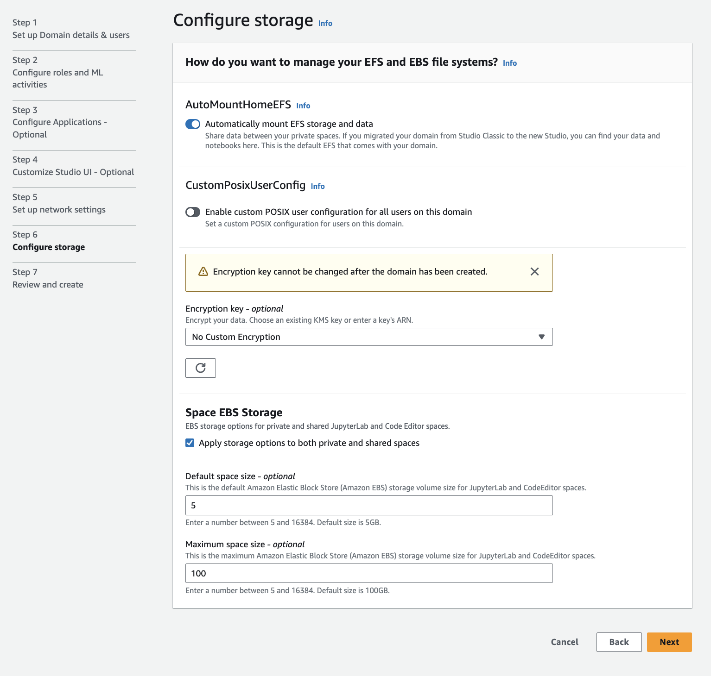

On the Review and create screen, confirm all of the settings followed the above, and click Submit.
Wait 10-15 minutes for the studio to build. It only takes this long on initial setup, in the future it will take 2-3 minutes to access an existing studio.


Open the studio by clicking `Domain` and then select your domain name.
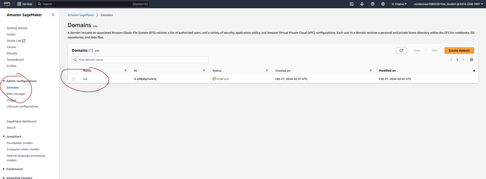

Select `User profiles` and then click `Add user`
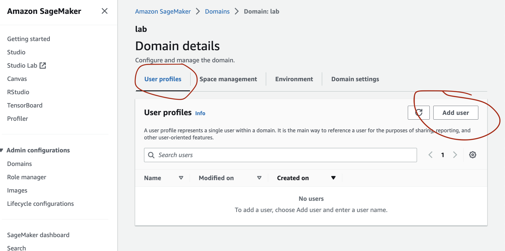

Leave the `General Settings` as is, execution role must be `LabRole`, click next.
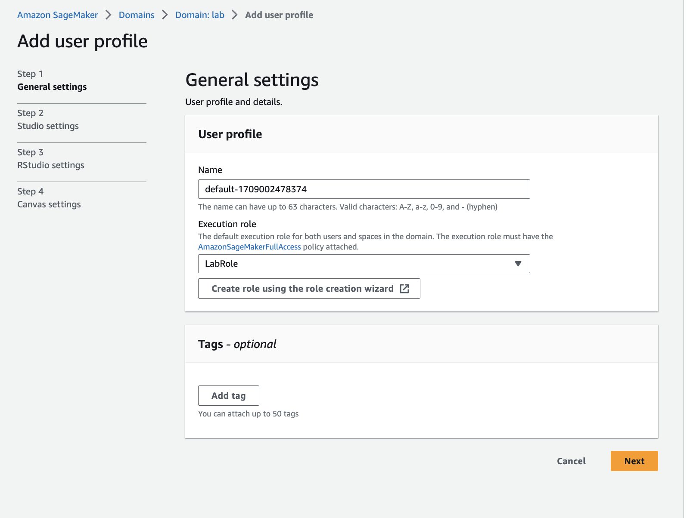

Under `SageMaker Studio` select `SageMaker Studio New`. Under `JupyterLab`, turn on `Enable idle shutdown`.


Expand the Canvas section and disable Amazon Q and disable both MLOps settings and disable `Enable local file upload`


Under `Canvas Ready-to-use models configuration` select `Use an existing execution role`
- Find your AWS ID by clicking on your username in the top right of the screen.
- 
- Replace `834486164294` from `arn:aws:iam::834486164294:role/LabRole` with your account ID (removing the `-`s)


- On the `Customize Studio UI` screen click Next.

- On the `Data and Storage` screen, do not change anything, click Next.

- On the review screen, click Submit.

Click `User Profile` and on your user click `Launch` and select `Studio`


On the left click the `JupyterLab` icon, then click the `Create JupyterLab Space` button on the top right
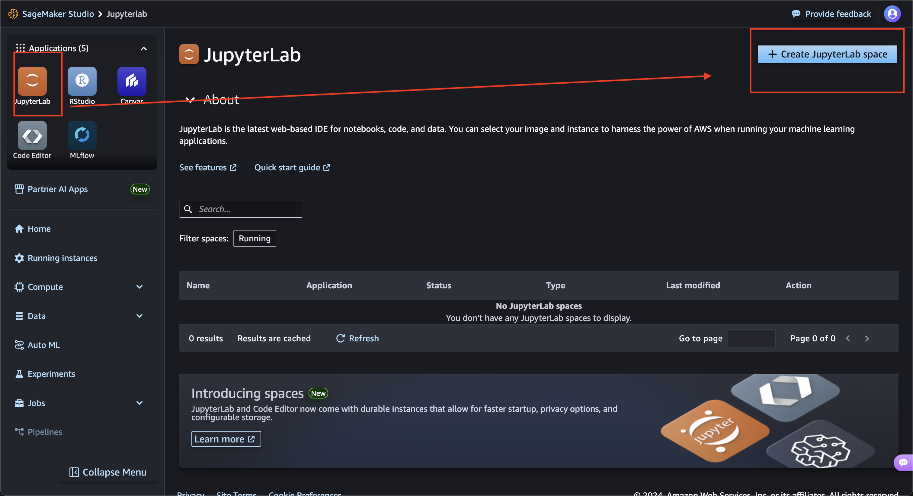

Enter a name for your space and click `Create Space` *It is suggested to make one named `lab` and one named `project`.*


Change instance to `ml.m5.xlarge` and change storage to `25` then click Run Space
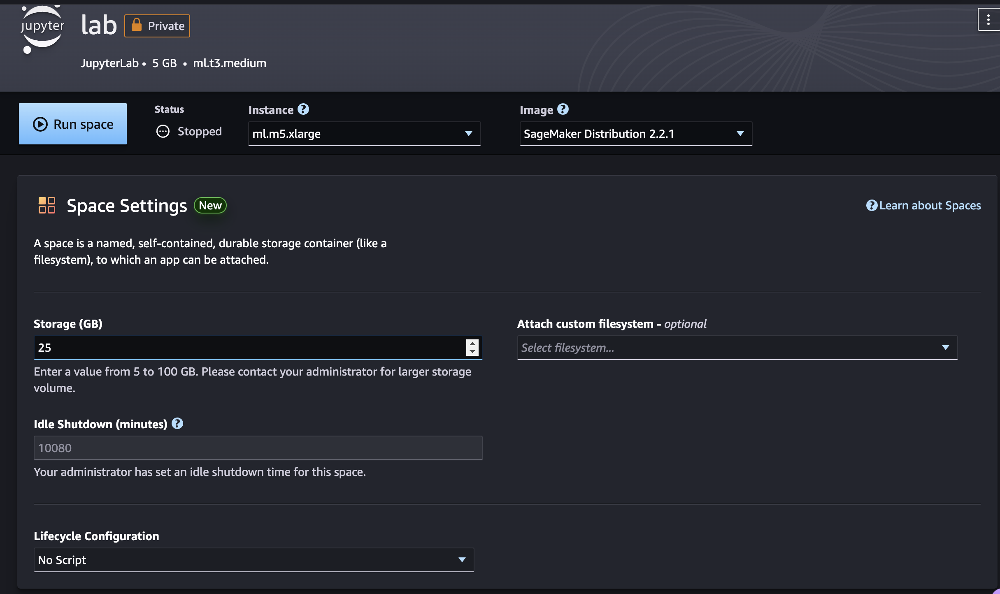

Once your JupyterLab space has been created, click the `Open` button.
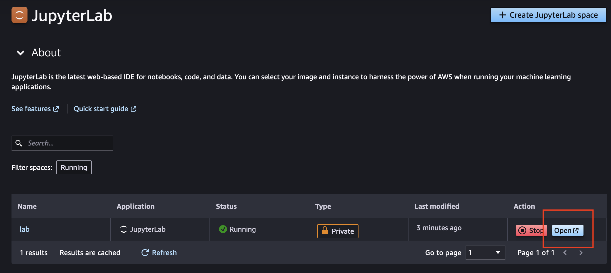

## 4. Launch a New Terminal within JupyterLab

Click `File` > `New` > `Terminal` to launch a terminal in your Jupyter instance.


## 5. Clone this GitHub Repo in the Terminal

Within the Terminal, run the following:
`git clone -b main https://github.com/mads508/labs.git`

If you see an error like the following, just re-run the command again until it works:
```
fatal: Unable to create '.git/index.lock': File exists.

Another git process seems to be running in this repository, e.g.
an editor opened by 'git commit'. Please make sure all processes
are terminated then try again. If it still fails, a git process
may have crashed in this repository earlier:
remove the file manually to continue.
```
_Note:  Just re-run the command again until it works._

## 6. Navigate to Lab 01
- On the Left hand side click the icon of the folder
- Click `labs`
- Click `01_oreilly_book`
- Double Click `01_Setup_Dependencies.ipynb`
- Use the default kernel `Python 3 (ipykernel)`, 
